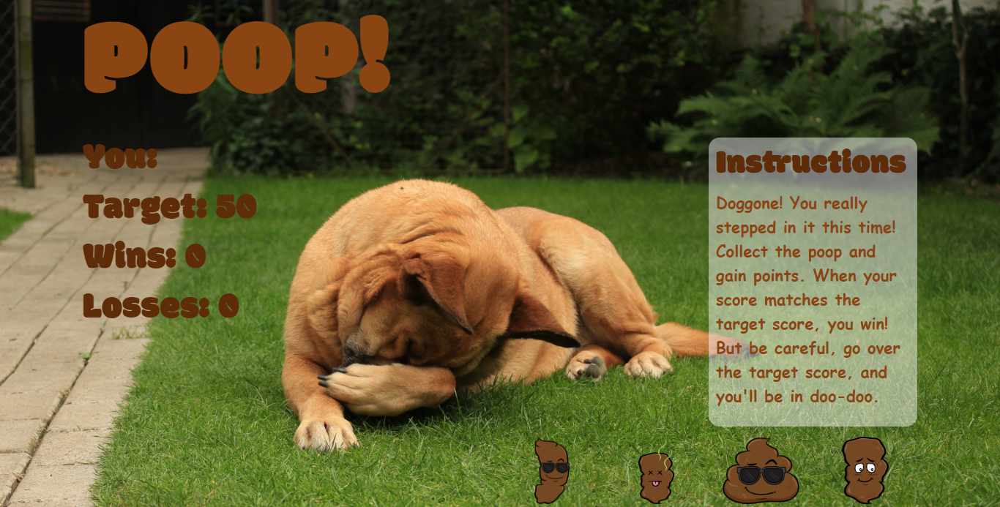

# Poop Game 💩

A fun and interactive game for web browsers. This app dynamically updates the HTML pages with the jQuery library.


## Functionality 💪
#### Here's how the app works: 


* There will be four poops displayed as buttons on the page.
```
for(var i = 0; i< poop.length; i++){
    poop[i].value = getRandom(1, 12);
    var div = $('<div>').addClass('col-md-3 col-sm-6 poo-pic');
    var img = $('').attr('src', poop[i].image).attr('alt', "poop").attr('id', "poop"+(i+1)).attr('data-index', i).addClass("button img-thumbnail")

    $(div).append(img)

    $("#poop-bag").append(div)
}
```

* The player will be shown a random number at the start of the game.

* When the player clicks on a poop, it will add a specific amount of points to the player's total score. 


* Your game will hide this amount until the player clicks a poop.
* When they do click one, update the player's score counter.

* The player wins if their total score matches the random number from the beginning of the game.
* The player loses if their score goes above the random number.

* The game restarts whenever the player wins or loses.

* When the game begins again, the player should see a new random number. Also, all the poops will have four new hidden values. The user's score (and score counter) will reset to zero.

```
function resetGame() {
    $(".img-thumbnail").each(function() {
        $(this).attr("disabled", true);
    })
    setTimeout(function(){ 
        yourNum = 0;
        $("#number").html("You: " + yourNum);
        $("#poop-bag, .modal-body").empty();
        $(".modal").modal("hide");  
        $(".img-thumbnail").each(function() {
            $(this).attr("disabled", false);
        })
      
        startGame();
    }, 2000);    
    
}
```

* The app should show the number of games the player wins and loses. To that end, do not refresh the page as a means to restart the game.

## Getting Started 🏁

These instructions will get you a copy of the project up and running on your local machine for grading and testing purposes. 

1. clone repository. 
2. open repository in your IDE of choice.
3. view `game.js` for logic.
4. view `index.html` for the document.
5. view `style.css` for the style.
6. open `index.html` in browser of choice to demo the application locally.


## Built With 🔧

* [Bootstrap](https://getbootstrap.com/) - css framework used.
* [JQuery](https://cdnjs.cloudflare.com/ajax/libs/jquery/3.2.1/jquery.min.js) - JavaScript library used.


## Authors ⌨️

* **Genevieve DePriest** - [gdepriest](https://github.com/gdepriest)

## Acknowledgments 🌟

* Amber Burroughs, Tutoring badass
* Lindsey, TA goddess
* Grace, TA goddess
* Sarah Cullen, Maestro
